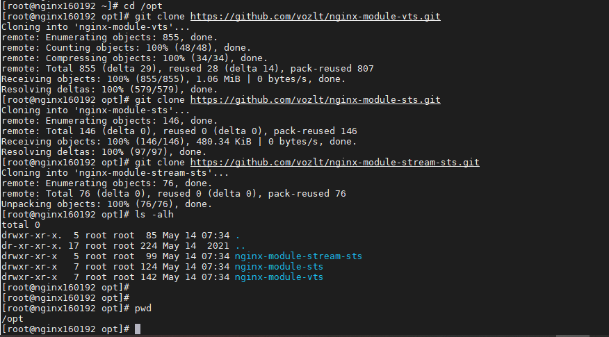
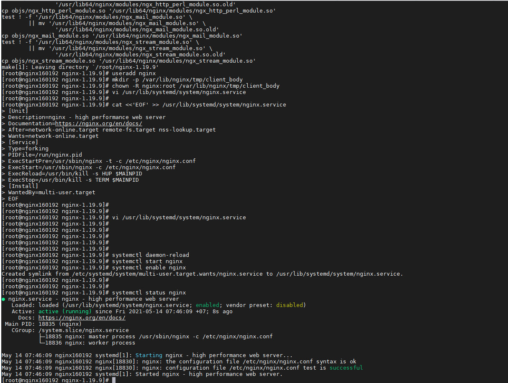
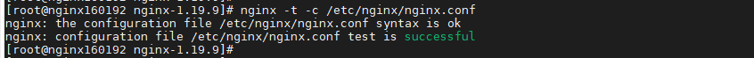
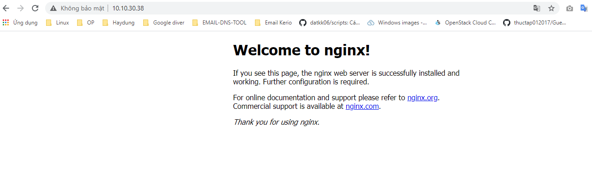

## Cài đặt nginx từ source trên CentOS7

### Mục lục

[1. Thiết lập ban đầu](#thietlap)<br>
[2. Cài đặt nginx từ source](#caidat)<br>


<a name="thietlap"></a>
## 1. Thiết lập ban đầu

**Thiết lập IP**

```
hostnamectl set-hostname prometheus-3035
sudo systemctl disable firewalld
sudo systemctl stop firewalld
sudo systemctl disable NetworkManager
sudo systemctl stop NetworkManager
sudo systemctl enable network
sudo systemctl start network
sed -i 's/SELINUX=enforcing/SELINUX=disabled/g' /etc/sysconfig/selinux
sed -i 's/SELINUX=enforcing/SELINUX=disabled/g' /etc/selinux/config
init 6
```

```
yum install epel-release -y
yum update -y
yum install wget -y
```

**Cài đặt NTPD**


```
yum install chrony -y 

systemctl start chronyd 
systemctl enable chronyd
systemctl restart chronyd 

chronyc sources -v
```

```
sudo date -s "$(wget -qSO- --max-redirect=0 google.com 2>&1 | grep Date: | cut -d' ' -f5-8)Z"
ln -f -s /usr/share/zoneinfo/Asia/Ho_Chi_Minh /etc/localtime
```

**CMD log**

```
curl -Lso- https://raw.githubusercontent.com/nhanhoadocs/ghichep-cmdlog/master/cmdlog.sh | bash
```

<a name="caidat"></a>
## 2. Cài đặt nginx từ source


- Cài đặt các package cần thiết để compile nginx từ source

```
yum groupinstall " Development Tools"  -y
yum install zlib-devel pcre-devel openssl-devel wget -y
yum install epel-release -y
```

- Cài đặt thêm các thành phần phụ thuộc của nginx

```
yum install dejavu-fonts-common dejavu-sans-fonts fontconfig fontpackages-filesystem gd gperftools-libs libX11 libX11-common libXau libXpm libjpeg-turbo libxcb libxslt pcre-devel openssl-devel libxml2-devel libxslt-devel perl-ExtUtils-Embed GeoIP-devel gperftools gperftools-devel gd-devel -y
```

- Download source nginx tại trang https://nginx.org/download/

```
cd /opt
git clone https://github.com/vozlt/nginx-module-vts.git
git clone https://github.com/vozlt/nginx-module-sts.git
git clone https://github.com/vozlt/nginx-module-stream-sts.git
```



```
wget https://nginx.org/download/nginx-1.19.9.tar.gz
```

- Buil nginx

```
tar -xzvf nginx-1.19.9.tar.gz
cd nginx-1.19.9
```


```
./configure --prefix=/usr/share/nginx --sbin-path=/usr/sbin/nginx --modules-path=/usr/lib64/nginx/modules --conf-path=/etc/nginx/nginx.conf --error-log-path=/var/log/nginx/error.log --http-log-path=/var/log/nginx/access.log --http-client-body-temp-path=/var/lib/nginx/tmp/client_body --http-proxy-temp-path=/var/lib/nginx/tmp/proxy --http-fastcgi-temp-path=/var/lib/nginx/tmp/fastcgi --http-uwsgi-temp-path=/var/lib/nginx/tmp/uwsgi --http-scgi-temp-path=/var/lib/nginx/tmp/scgi --pid-path=/run/nginx.pid --lock-path=/run/lock/subsys/nginx --user=nginx --group=nginx --with-file-aio --with-ipv6 --with-http_auth_request_module --with-http_ssl_module --with-http_v2_module --with-http_realip_module --with-http_addition_module --with-http_xslt_module=dynamic --with-http_image_filter_module=dynamic --with-http_geoip_module=dynamic --with-http_sub_module --with-http_dav_module --with-http_flv_module --with-http_mp4_module --with-http_gunzip_module --with-http_gzip_static_module --with-http_random_index_module --with-http_secure_link_module --with-http_degradation_module --with-http_slice_module --with-http_stub_status_module --with-http_perl_module=dynamic --with-mail=dynamic --with-mail_ssl_module --with-pcre --with-pcre-jit --with-stream=dynamic --with-stream_ssl_module --with-google_perftools_module --with-debug --with-cc-opt='-O2 -g -pipe -Wall -Wp,-D_FORTIFY_SOURCE=2 -fexceptions -fstack-protector-strong --param=ssp-buffer-size=4 -grecord-gcc-switches -specs=/usr/lib/rpm/redhat/redhat-hardened-cc1 -m64 -mtune=generic' --with-ld-opt='-Wl,-z,relro -specs=/usr/lib/rpm/redhat/redhat-hardened-ld -Wl,-E' --add-module=/opt/nginx-module-vts --add-module=/opt/nginx-module-sts
```

```
make
make install
```

- Tạo user và tiến hành phân quyền owner cho thư mục

```
useradd nginx
mkdir -p /var/lib/nginx/tmp/client_body
chown -R nginx:root /var/lib/nginx/tmp/client_body
```

- Tạo file để chạy lệnh mỗi khi stop hoặc start service nginx

```
cat <<'EOF' >> /usr/lib/systemd/system/nginx.service
[Unit]
Description=nginx - high performance web server
Documentation=https://nginx.org/en/docs/
After=network-online.target remote-fs.target nss-lookup.target
Wants=network-online.target


[Service]
Type=forking
PIDFile=/run/nginx.pid
ExecStartPre=/usr/sbin/nginx -t -c /etc/nginx/nginx.conf
ExecStart=/usr/sbin/nginx -c /etc/nginx/nginx.conf
ExecReload=/usr/bin/kill -s HUP $MAINPID
ExecStop=/usr/bin/kill -s TERM $MAINPID


[Install]
WantedBy=multi-user.target
EOF
```

- Khởi động service

```
systemctl daemon-reload
systemctl start nginx
systemctl enable nginx
```




- Kiểm tra cú pháp file cấu hình nginx

```
nginx -t -c /etc/nginx/nginx.conf 
```



- Truy cập kiểm tra test cấu hình

```
http://IP_server_nginx/
```



### Tham khảo


https://docs.nginx.com/nginx/admin-guide/installing-nginx/installing-nginx-open-source/

https://www.digitalocean.com/community/tutorials/how-to-install-nginx-on-centos-7

https://blog.cloud365.vn/linux/cai-dat-nginx/

