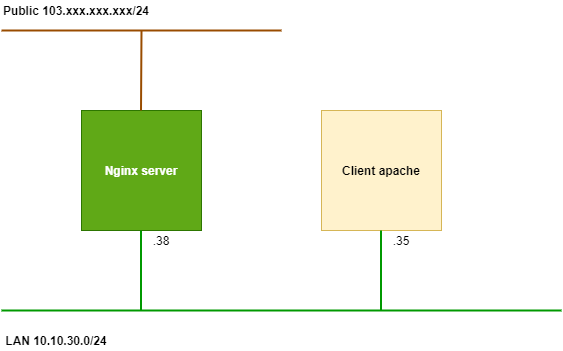
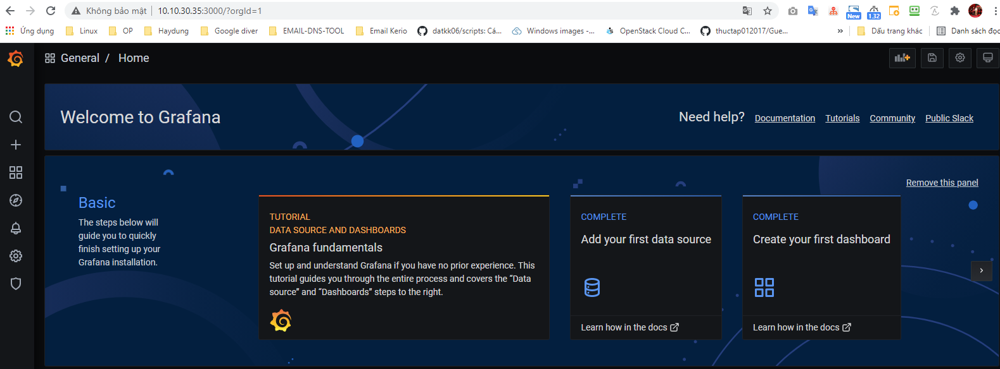
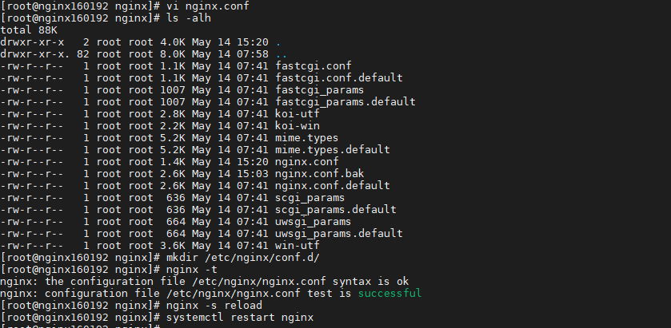
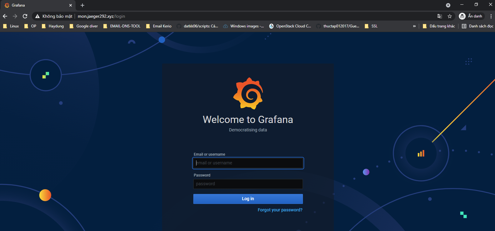
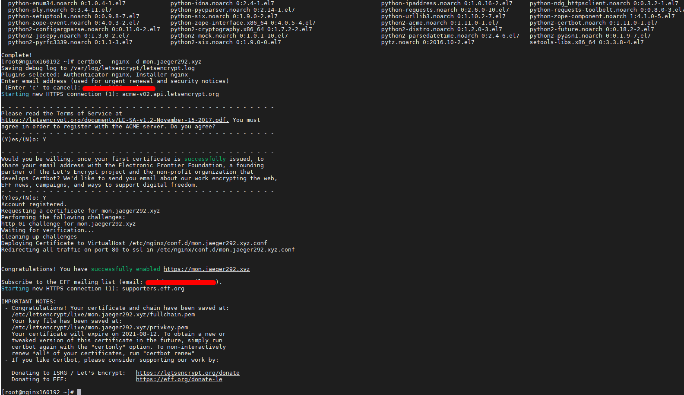
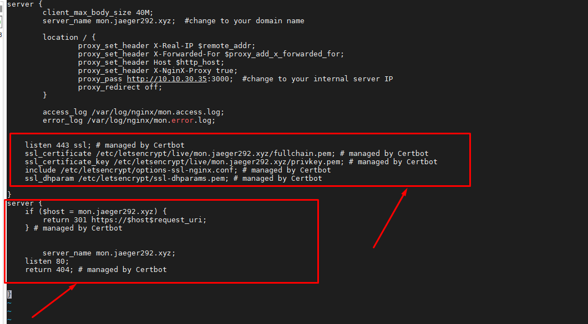
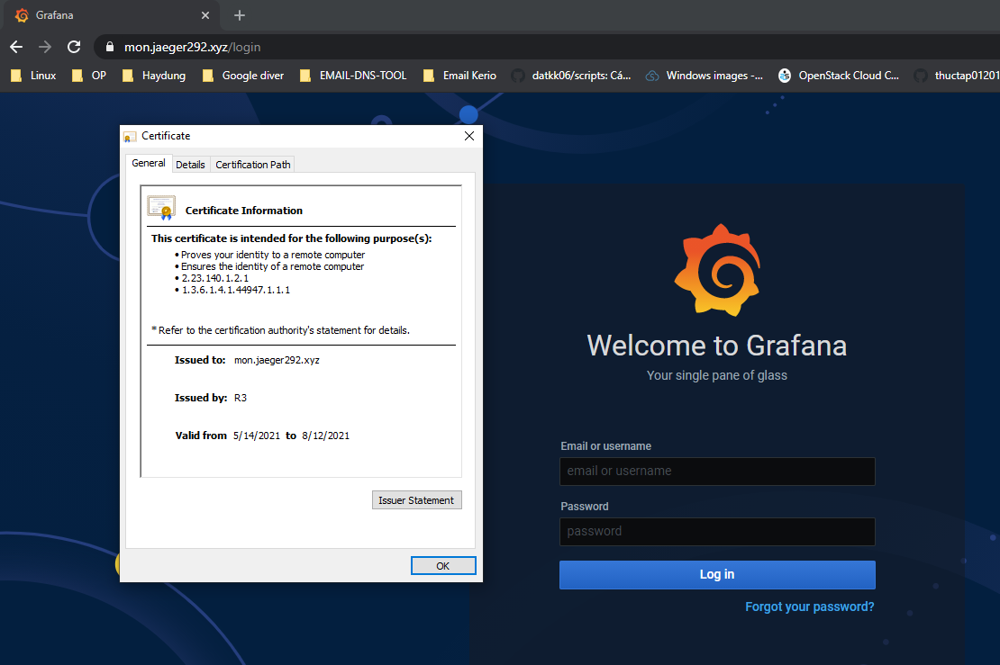
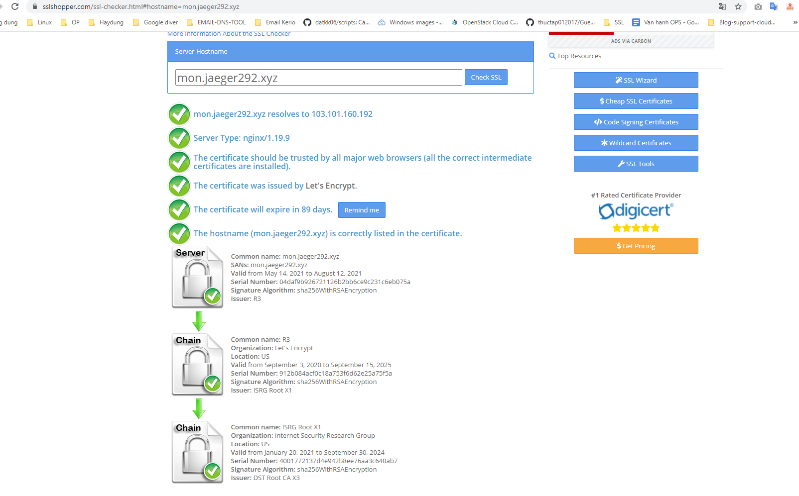
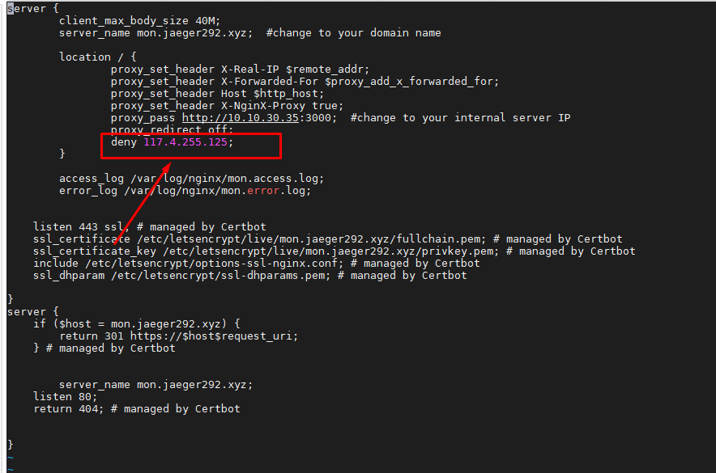

## Cài đặt nginx reverse proxy apache



## 1. Chuẩn bị

- Chuẩn bị 1 server nginx

- 01 server cài đặt apache (ở trong bài lab này client là server cài grafana hoạt động ở port 3000)



## 2. Nginx reverse proxy apache

**Thao tác trên nginx server**

- Backup config nginx

```
mv /etc/nginx/nginx.conf nginx.conf.bak
```

- Chỉnh sửa cấu hình file `/etc/nginx/nginx.conf` với nội dung ở dưới

```
user nginx;
worker_processes auto;
error_log /var/log/nginx/error.log;
pid /run/nginx.pid;
include /usr/share/nginx/modules/*.conf;
events {
    worker_connections 1024;
}
http {
    log_format  main  '$remote_addr - $remote_user [$time_local] "$request" '
                      '$status $body_bytes_sent "$http_referer" '
                      '"$http_user_agent" "$http_x_forwarded_for"';
    access_log  /var/log/nginx/access.log  main;
    sendfile            on;
    tcp_nopush          on;
    tcp_nodelay         on;
    keepalive_timeout   75;
    #keepalive_disable none;
    types_hash_max_size 2048;
    include             /etc/nginx/mime.types;
    default_type        application/octet-stream;
    # Load modular configuration files from the /etc/nginx/conf.d directory.
    # See http://nginx.org/en/docs/ngx_core_module.html#include
    # for more information.
    include /etc/nginx/conf.d/*.conf;
    server {
        listen       80 default_server;
        listen       [::]:80 default_server;
        server_name  _;
        root         /usr/share/nginx/html;
        # Load configuration files for the default server block.
        include /etc/nginx/default.d/*.conf;
        location / {
        }
        error_page 404 /404.html;
            location = /40x.html {
        }
        error_page 500 502 503 504 /50x.html;
            location = /50x.html {
        }
    }
}
```

```
mkdir /etc/nginx/conf.d/
nginx -t
nginx -s reload
systemctl restart nginx
```



- Tạo cấu hình vhost

```
cd /etc/nginx/conf.d
vi mon.jaeger292.xyz.conf
```

Thêm nội dung

```
server {
        client_max_body_size 40M;
        server_name mon.jaeger292.xyz;  #change to your domain name

        location / {
                proxy_set_header X-Real-IP $remote_addr;
                proxy_set_header X-Forwarded-For $proxy_add_x_forwarded_for;
                proxy_set_header Host $http_host;
                proxy_set_header X-NginX-Proxy true;
                proxy_pass http://10.10.30.35:3000;  #change to your internal server IP
                proxy_redirect off;
        }

        access_log /var/log/nginx/mon.access.log;
        error_log /var/log/nginx/mon.error.log;
}
```

Kiểm tra cú pháp cấu hình

```
nginx -t
nginx -t -c /etc/nginx/conf.d/mon.jaeger292.xyz.conf
nginx -t mon.jaeger292.xyz.conf
```

```
nginx -s reload
systemctl restart nginx
```

Truy cập test qua domain `mon.jaeger292.xyz`



## 3. Cài đặt SSL Let's Encrypt vhost nginx proxy

```
sudo yum install certbot-nginx -y
certbot --nginx -d mon.jaeger292.xyz
```



Quá trình cài đặt Let's Encrypt sẽ tự động config SSL vào file `mon.jaeger292.xyz.conf` thêm khối lệnh sau vào cấu hình



Kiểm tra Let's Encrypt.






## 4. Allow, deny IP truy cập domain vhost

Để deny IP không có phép truy cập vào domain vhost thêm config `deny IP;` và khối `location` trong config domain vhost



```
server {
        client_max_body_size 40M;
        server_name mon.jaeger292.xyz;  #change to your domain name

        location / {
                proxy_set_header X-Real-IP $remote_addr;
                proxy_set_header X-Forwarded-For $proxy_add_x_forwarded_for;
                proxy_set_header Host $http_host;
                proxy_set_header X-NginX-Proxy true;
                proxy_pass http://10.10.30.35:3000;  #change to your internal server IP
                proxy_redirect off;
                deny 117.4.255.125;
        }

        access_log /var/log/nginx/mon.access.log;
        error_log /var/log/nginx/mon.error.log;


    listen 443 ssl; # managed by Certbot
    ssl_certificate /etc/letsencrypt/live/mon.jaeger292.xyz/fullchain.pem; # managed by Certbot
    ssl_certificate_key /etc/letsencrypt/live/mon.jaeger292.xyz/privkey.pem; # managed by Certbot
    include /etc/letsencrypt/options-ssl-nginx.conf; # managed by Certbot
    ssl_dhparam /etc/letsencrypt/ssl-dhparams.pem; # managed by Certbot

}
server {
    if ($host = mon.jaeger292.xyz) {
        return 301 https://$host$request_uri;
    } # managed by Certbot


        server_name mon.jaeger292.xyz;
    listen 80;
    return 404; # managed by Certbot


}
```

```
nginx -s reload
```

Kiểm tra, nếu người dùng ở nơi IP bị chặn thì sẽ báo `nginx 403`


- Cú pháp chặn khác nhau

Chặn 1 IP

```
deny    192.168.1.1;
```

Chặn 1 subnet

```
allow   192.168.1.0/24;
```

Chặn all

```
deny    all;
```

Sau khi thao tác chặn hoặc allow thì phải `nginx -s reload`

## 5. Auto renew SSL Let's Encrypt

```
[root@nginx160192 nginx]# crontab -l
15 3,12 * * * /bin/certbot renew --quiet
```

```
/bin/certbot renew
```

### Tham khảo

https://www.digitalocean.com/community/tutorials/how-to-secure-nginx-with-let-s-encrypt-on-centos-7

https://www.server-world.info/en/note?os=CentOS_7&p=nginx&f=6

